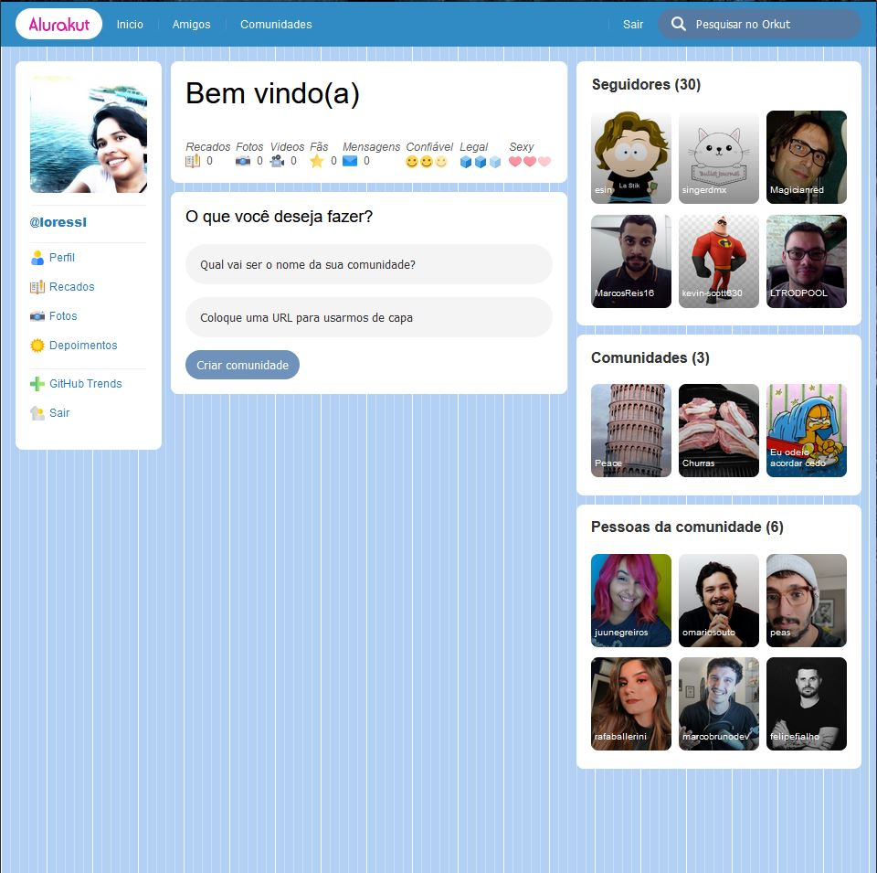

## Imersão React 3ª edição 

Projeto desenvolvido durante a 3ª edição da Imersão React promovida pela [Alura](https://www.alura.com.br/).

## Screens


## Tecnologias
 - [React](https://reactjs.org)
 - [Next.JS](https://nextjs.org/)
 - [styled-components](https://styled-components.com/)

## Instalação
```bash
yarn install
# ou
npm install
```

## Executar projeto
```bash
yarn dev
# ou
npm run dev
```
